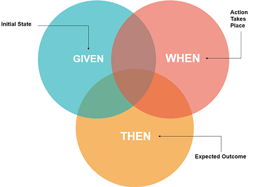

## Proyecto TP3 Testing - IOT (UBA)

Autor:
* Iván Cruz Flores

Docentes:

* Esp. Ing. Estevan Volentini.
* Esp. Ing. Alejandro Permingeat.
* Carlos Pantelides.

## TEMA: BDD - Testing
El Desarrollo Guiado por el Comportamiento o BDD (behavior-driven development) es un proceso que amplia las ideas de TDD y las combina con otras ideas de diseño de software y análisis de negocio para proporcionar un proceso ( y una serie de herramientas ) a los desarrolladores, con la intención de mejorar el desarrollo del software, BDD se basa en TDD formalizando las mejores practicas de TDD, clarificando cuales son y haciendo énfasis en ellas.



## Lista de requerimientos desarrollados

Dado una lista vacia:

```
1.  La lista debe almacenar pares clave:valor.
2.  Las claves almacenadas en la lista deben ser únicas.
3.  Las claves son cadenas de texto.
4.  Se debe poder recuperar un valor a partir de una clave.
5.  Se debe poder actualizar el valor asociado a una clave.
6.  Se debe poder borrar una pareja a partir de la clave.
7.  Se debe poder recuperar la cantidad de elementos almacenados en la lista.
8.  Se debe poder recuperar una lista ordenada de las claves almacenadas en la lista.
```

## Este proyecto esta formado por:
* Node Js.
* Chai Js.
* Cucumber Js.


